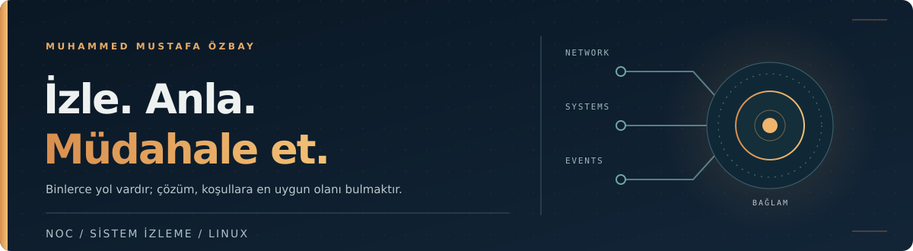
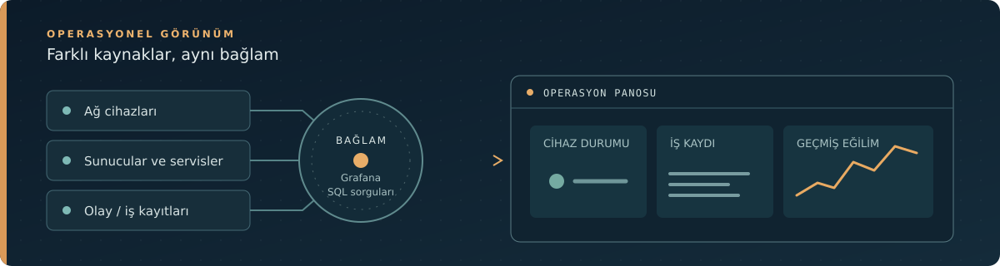
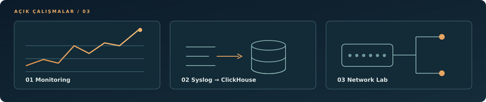

## Hakkımda

**NOC · Sistem İzleme · Linux ve Ağ Operasyonu**

Ağ ve sistem altyapılarında olayları takip ediyor, sorunları araştırıyor ve operasyon ekiplerinin durumu daha hızlı görmesine yardımcı olan izleme ekranları geliştiriyorum. NOC deneyimimi yazılım geliştirme geçmişimle birleştirerek, günlük operasyonun ihtiyaçlarına yönelik küçük araçlar ve entegrasyonlar hazırlıyorum.

İstanbul'da NOC sistem uzmanı olarak çalışıyorum. Bir alarmı değerlendirirken etkilenen cihazı veya servisi, ilgili iş kaydını ve geçmişteki eğilimini aynı bağlamda incelemeye odaklanıyorum.

## İşimden örnekler

### Olayları görünür kılmak

Grafana ve SQL sorgularıyla farklı sistemlerden gelen bilgileri bir araya getiriyorum. İş kaydı açılmış olayların takibi, ağ cihazlarının durumu ve operasyonel raporlama için panolar hazırladım. Böylece ekiplerin tek tek sistemler arasında dolaşmadan durumu değerlendirebilmesini hedefliyorum.

### Sorunun kaynağını araştırmak

Linux servisleri ve sunucuların kaynak kullanımını, sanallaştırma ortamlarını ve ağ cihazlarını izliyorum. Donanım yönetim arayüzleri üzerinden kontroller, ilk müdahale ve Cisco Layer 2 ağlarında sorun araştırması günlük işimin parçaları. Gerektiğinde ilgili ekipler ve saha personeliyle çözüm sürecini yürütüyorum.

### Operasyon için araç geliştirmek

Go ve TypeScript ile izleme sistemleri arasında entegrasyon prototipleri ve tekrar eden işleri kolaylaştıran araçlar geliştiriyorum. Bir aracın benim için değeri, teknik olarak ilginç olmasının yanında operasyon sırasında gerçekten işe yaraması.

## Geliştirme sürecimde yapay zekâ

Yapay zekâ araçlarını araştırma, teknik seçenekleri karşılaştırma, kod ve dokümantasyon taslakları hazırlama ve sorunlara farklı yaklaşımlar bulma amacıyla kullanıyorum. Önerileri kendi teknik bağlamımda inceliyor; uygulama kararlarını ve yayımladığım işin sorumluluğunu üstleniyorum.

Bu README'nin metni ve SVG görselleri de yapay zekâ desteğiyle, benim yönlendirme ve düzenlemelerimle hazırlandı.

## Açık çalışmalarım

| Çalışma | Ne gösteriyor? |
| --- | --- |
| [Monitoring örnek kurulumu](https://github.com/MuhammedOzby/monitoring-for-public-share) | Prometheus, Grafana, Alertmanager ve SNMP Exporter bileşenlerinin Docker ile bir araya getirildiği örnek kurulum. |
| [Syslog Handler with ClickHouse](https://github.com/MuhammedOzby/syslog-handler-with-clickhouse) | UDP syslog mesajlarını işleyip ClickHouse'a toplu yazan Go prototipi. |
| [Network Examples](https://github.com/MuhammedOzby/network-examples) | GNS3 ağ senaryolarına ait dosyalar ve örnekler. |

Kurum içindeki izleme ekranlarının ve operasyon araçlarının tamamı açık kaynak olarak paylaşılabilir değil. Yukarıdaki repolar, üzerinde çalıştığım konuların herkese açık örnekleri.

## Şu anda

LPIC-1 için Linux sistem yönetimi çalışıyorum. Ağ envanteri, metrik toplama ve alarm üretimini birbirinden ayıran bir izleme laboratuvarı da planlıyorum; tamamlanan parçaları zamanla paylaşacağım.

## İletişim

[Portfolyo](https://ozbay.dev) · [LinkedIn](https://www.linkedin.com/in/muhammed-mustafa-ozbay/) · [E-posta](mailto:muhammed.ozby@outlook.com)
